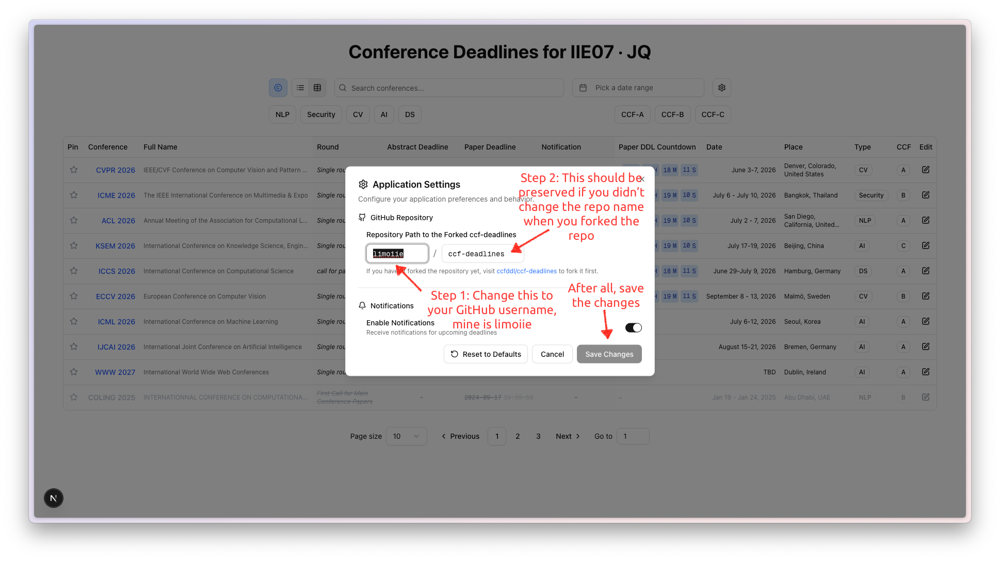

# Conference Data Maintenance

This project uses conference deadline data directly from the well-known [ccfddl/ccf-deadlines](https://github.com/ccfddl/ccf-deadlines) repository, with the addition of a few non-CCF conferences listed in [[data/conferences]], including MLICOM, ICCS, and ISCC.

The project is hosted with an automated daemon that pulls the latest conference data from [ccfddl/ccf-deadlines](https://github.com/ccfddl/ccf-deadlines) automatically.

For maintainers responsible for keeping conference deadlines up-to-date, you only need to track conference events and update the configuration files in the [ccfddl/ccf-deadlines](https://github.com/ccfddl/ccf-deadlines) repository.

## Update Process

All updates can be performed directly through your web browser.

### Step 0: Open the Settings Dialog and Set the Fork URL

You need to configure your fork URL because changes must be made on your forked repository rather than the original repository, as you don't have write permissions to the original repo.

If you haven't forked the original repository yet, navigate to [ccfddl/ccf-deadlines](https://github.com/ccfddl/ccf-deadlines) and create a fork.

### Step 1: Navigate to the Conference Configuration Page

Click the edit button to access the configuration page.

### Step 2: Make Your Changes

Update the configuration by adding new conference editions following the established format. Once you're done, click the `Commit changes` button to open the commit dialog.

### Step 3: Create a Pull Request

After committing to your forked repository, create a pull request to request that your changes be merged into the original repository.

### Step 4: Monitor Progress

Monitor the pull request page for updates and feedback from the maintainers.
